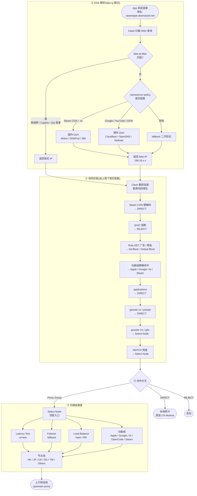

# Clash Rule Scripts

> Clash 配置预处理脚本 · 自动增强 DNS / 路由 / 代理组,让 fake-ip 模式也能稳跑 Steam 等下载。

[✨ 亮点](#亮点) · [🚀 快速开始](#快速开始) · [📦 文件一览](#文件一览) · [📊 代理组结构](#代理组结构) · [⚙️ 可定制点](#可定制点) · [🔍 FAQ](#faq) · [📜 CHANGELOG](CHANGELOG.md)

---

## ✨ 亮点

- **Steam 下载直连** — fake-ip 模式下也满速,不受代理隧道 UDP 损耗影响
- **一站式规则增强** — 注入 DNS、广告拦截、CN/境外分流、微软/苹果/谷歌等服务路由
- **自适应地区分组** — 自动识别节点地区(HK/JP/US/SG/TW),非主流节点归属 Others 组统一调度
- **OpenCode 专用组** — 为 opencode AI 编程代理的 Zen 网关流量提供独立策略控制
- **桌面 + 移动同步维护** — 三套脚本各司其职,修改一只手同步

## 🚀 快速开始

**桌面(Clash Verge Rev):**

1. Profiles → 选一个 profile → 预处理(Processing) → Script
2. `Clash_script_v1.js`(中文)或 `Clash_script_v1_en.js`(英文)
3. 填入脚本绝对路径,重载 profile

**移动(Clash Meta for Android / Stash):**

1. 设置 → 脚本 / Script → 启用 JS 预处理
2. 路径填入 `Clash_script_mobile.js`
3. 重载配置

脚本在订阅源加载后自动执行 `main(config)`,就地增强配置。订阅源更新时自定义规则**不会丢失**——因为它们是脚本注入,不是写进 YAML。

## 📦 文件一览

| 文件 | 客户端 | 注释 | 桌面 | 移动 |
|------|--------|------|------|------|
| `Clash_script_v1.js` | Clash Verge Rev | 中文 | ✅ | — |
| `Clash_script_v1_en.js` | Clash Verge Rev | English | ✅ | — |
| `Clash_script_mobile.js` | Clash Meta for Android / Stash | 中文 | — | ✅ |

桌面中英两版**功能完全一致**,修改必须同步。文件名 `_v1` / `_mobile` 是系列代号,不随小版本变化;版本号靠 [CHANGELOG.md](CHANGELOG.md) + git tag。桌面与移动是独立发布线。

## 📊 代理组结构

面板按「常用 / 不常用」两区显示,`Fallback` 是分界线。仅视觉聚合,引用关系不受影响。

### 常用区(`Select Node` → `Fallback`)

| 分组 | 类型 | 说明 |
|------|------|------|
| `Select Node` | select | 顶层手动入口,含自动化组 + 全部节点(`include-all`) |
| `HK - 香港` / `JP - 日本` / `US - 美国` | select | 主流地区,正则自动识别节点名生成 |
| `Google Services` / `Foreign Media` / `Social Media` | select | 功能组,上游为 `standardProxies` |
| `AI Overseas` | select | ChatGPT / Gemini 等,健康检查 `chatgpt.com` |
| `OpenCode` | select | opencode 命令行代理自有流量(见下) |
| `Microsoft Services` / `Apple Services` / `Steam` | select | 平台服务,默认直连/代理因服务而异 |
| `Fallback` | select | 兜底组,未被规则命中的流量最终落点 |

### 不常用区(`Fallback` 之后)

| 分组 | 类型 | 说明 |
|------|------|------|
| `Others` | select | 聚合**所有节点**(`include-all`),覆盖非主流地区(KR/DE/UK 等) |
| `SG - 新加坡` / `TW - 台湾` | select | 非主流地区组,正则自动识别 |
| `Latency Test` | url-test | 自动选延迟最低节点 |
| `Failover` | fallback | 主节点失效自动切换 |
| `Load Balance (Hash)` / `Load Balance (Round Robin)` | load-balance | 一致性哈希 / 轮询(均 `hidden`) |
| `Ad Block` / `Global Block` | select | 拦截组,默认 `REJECT` |

### 地区组识别机制

`regions` 数组定义地区名 + 正则,**逐地区**从 `allProxies` 过滤节点名:
- 有匹配 → 生成 `select` 组;无匹配 → 跳过
- CJK 关键词无 `\b`(JS `\b` 对中文无效),英文/数字保留 `\b` 防子串误匹配
- `regionalGroupNames` 含所有地区组名(含 SG/TW/Others),合入 `standardProxies` 作为功能组可选上游

### OpenCode 组

路由 `opencode.ai`(Zen API 网关 / OAuth 登录 / 会话分享 / 文档站)+ `anoma.ly`(母公司域,账单/帮助站)。
健康检查用 `https://opencode.ai`。
**注意**:用户 BYOK 直连第三方 LLM(`api.openai.com` 等)的流量**不走此组**,仍由 `openai` 规则集 / `proxy` 列表 / `Fallback` 调度。

## ⚙️ 可定制点

打开任一 JS 文件,顶部一节是「常量定义」,改完保存即可生效:

| 变量 | 控制什么 | 常见改动 |
|------|---------|---------|
| `domesticNameservers` | 国内 DNS(解析 CN 域名) | 换更快的 DoH,如 `https://1.12.12.12/dns-query` |
| `foreignNameservers` | 境外 DNS | 换 Cloudflare / Google |
| `steamCDN` 列表 | Steam CDN 域名(直连解析) | 加新发现的 CDN |
| `proxyGroups` | 代理组定义 | 改名 / 改选择策略 |
| `healthCheck.interval` | 节点健康检查间隔 | 移动端调长省电 |
| `healthCheck.tolerance` | 延迟容忍 | 蜂窝网络调到 50 ms |

> 改完别忘了:中英两版同步改 + 改 CHANGELOG + commit + 视情况打 tag。

## 🔍 FAQ

常见问题与故障排查

| 症状 | 原因 | 排查 |
|------|------|------|
| Steam 下载 0 bps | nameserver-policy 顺序错 | 确认 `steamCDN` 在 `geosite:geolocation-!cn` 之前 |
| Steam 下载走代理 | Steam CDN 进了 fake-ip-filter | 检查 `fake-ip-filter` 列表 |
| 国内网站解析到境外 IP | 国内 DNS 不通 | 测试 `domesticNameservers` 里的 DoH |
| 移动端节点延迟狂跳 | 容忍阈值太严 | 调 `healthCheck.tolerance` 到 50+ ms |
| 日志报 `main is not defined` | 客户端没启用 JS 预处理 | Profile 设置里勾上 Script |
| Clash Verge 加载报语法错 | 文件被存为 CRLF | 仓库已强制 LF,确认编辑器存为 LF |

## 🔄 流量处理流程

点击展开 — 从 DNS 到代理的完整链路

下面以一个真实请求(应用要下载 Steam 内容 `steampipe.akamaized.net`)为线索,展示从 DNS 查询到上游代理的完整链路。

**关键节点说明:**

| 阶段 | 要点 |
|------|------|
| ① DNS | `fake-ip-filter` 命中 → 走真实 IP(局域网 / QQ 微信 / Windows Captive) |
| ① DNS | `nameserver-policy` 命中 Steam CDN → 国内 DoH 解析 → 国内 CDN IP |
| ② 规则 | 规则链前 3 条都是 `DIRECT`(Steam CDN / QUIC / applications) |
| ② 规则 | 规则链最末 2 条是 `Select Node`(geosite !cn + MATCH 兜底) |
| ③ 调度 | 代理组最终汇聚到节点池,按 url-test / fallback / load-balance 选出节点 |

## 提交规范

| 前缀 | 用途 |
|------|------|
| `feat:` | 新规则、新功能 |
| `fix:` | 修复问题 |
| `refactor:` | 重构(不改变行为) |
| `perf:` | 性能优化 |
| `docs:` | 仅文档 |
| `chore:` | 杂项(初始化、配置) |

## 致谢

脚本引用以下第三方开源资源:

- **规则集**: [blackmatrix7/ios_rule_script](https://github.com/blackmatrix7/ios_rule_script) · [Loyalsoldier/clash-rules](https://github.com/Loyalsoldier/clash-rules)
- **DNS**: [阿里云 DNS](https://www.alidns.com/) · [腾讯 DNSPod](https://www.dnspod.cn/) · [Cloudflare](https://developers.cloudflare.com/1.1.1.1/) · [OpenDNS](https://www.opendns.com/) · [Mullvad DNS](https://mullvad.net/en/help/dns-over-https-and-dns-over-tls)
- **图标**: [clash-verge-rev/clash-verge-rev.github.io](https://github.com/clash-verge-rev/clash-verge-rev.github.io)

---

## 协议

[MIT](./LICENSE)
