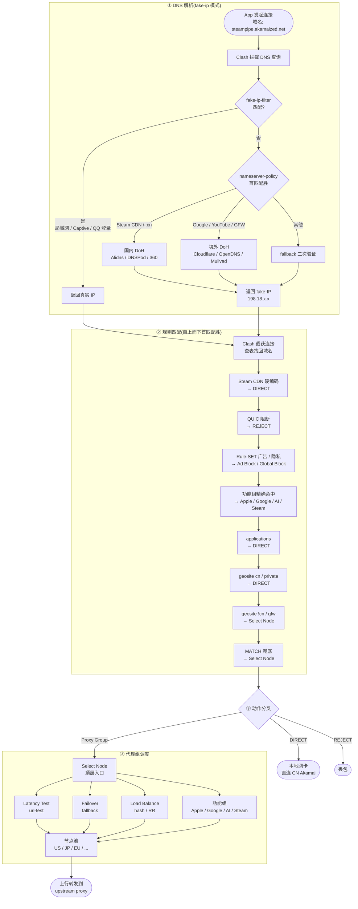

# Clash Rule Scripts

> 个人用的 Clash 代理配置预处理脚本集。
> 三个 JS 文件,夹在订阅源和 Clash 客户端之间,
> 注入 DNS、路由规则、代理组,让 fake-ip 模式也能稳跑 Steam 等下载。

## 这是什么 / 不什么

- ✅ 是:Clash Verge Rev / Clash Meta for Android / Stash 用的 JS 预处理脚本
- ✅ 解决:fake-ip 模式下 Steam 下载为 0 bps、广告拦截、CN/境外分流、移动端兼容
- ❌ 不是:Clash 完整规则集(规则大部分来自订阅源)
- ❌ 不是:Clash 客户端本体(只增强配置,不替代)
- ❌ 不包含:订阅 URL / token / 节点信息(这些由 Clash 客户端运行时注入)

## 三个文件

| 文件 | 适用客户端 | 注释语言 | 当前版本 | 字节 |
|------|-----------|---------|---------|------|
| `Clash_script_v1.js` | Clash Verge Rev(桌面) | 中文 | v1.2 | 44.6 KB |
| `Clash_script_v1_en.js` | Clash Verge Rev(桌面) | English | v1.2 | 47.0 KB |
| `Clash_script_mobile.js` | Clash Meta for Android / Stash (iOS) | 中文 | v1.2 | 35.9 KB |

> 字节数为 **撰写时大小**,每次提交都会变,仅作大致参考。

桌面中英两版**功能完全一致**,仅注释语言不同。
**任何对桌面版的修改必须同步两个文件。**

## 怎么用

**桌面(Clash Verge Rev):**
1. Profiles → 选一个 profile → 预处理(Processing) → Script
2. 填入脚本绝对路径,例如 `C:\Users\alize\Desktop\developer\VPS\script\Clash_script_v1_en.js`
3. 重载 profile,日志里会看到 `main(config)` 调用

**移动(Clash Meta for Android / Stash):**
1. 设置 → 脚本 / Script → 启用 JS 预处理
2. 路径填入 `Clash_script_mobile.js`
3. 重载配置

## 脚本工作机制

Clash 客户端在加载订阅源后,会调用 `main(config)` 传入配置对象。
脚本**就地修改**这个对象(覆盖 DNS、规则、代理组),然后返回。
订阅源更新时自定义规则**不会丢失**——因为它们是脚本注入,不是写进 YAML。

## 流量处理流程

下面以一个真实请求(应用要下载 Steam 内容 `steampipe.akamaized.net`)为线索,展示从 DNS 查询到上游代理的完整链路。**三个阶段串成一条线**:

### 关键节点速记(配合上图)

- **`fake-ip-filter` 命中** → 走真实 IP(局域网、QQ/微信 快速登录、Windows Captive 等)
- **`nameserver-policy` 命中 Steam CDN** → 国内 DoH 解析 → 拿到国内 Akamai CDN IP → fake-IP 198.18.x.x
- **规则链前 3 条都是 `DIRECT`**(Steam CDN、QUIC 阻断后的 Google 流量、applications)——这些流量完全不出本机网卡
- **规则链最末 2 条**是 `Select Node`(geosite !cn / gfw + MATCH 兜底),承担「被 GFW 屏蔽的境外服务」代理
- **代理组最终汇聚到「节点池」**(US / JP / EU / HK / SG / ...),按 url-test / fallback / load-balance 策略选出 1 个节点

### 与「Steam 三大原则」的对应

- 原则 1(规则顺序):图 ② 中 R1 在 R2/R3 之前,Steam CDN 不被广告规则集 REJECT
- 原则 2(fake-ip-filter 边界):图 ① 中 Steam CDN 域名**不在** `fake-ip-filter` 内,继续走 fake-IP 路径
- 原则 3(nameserver-policy 顺序):图 ① 中 Steam CDN 条目在 `geosite:geolocation-!cn` 之前,命中 Q5 国内 DoH

## 可定制点(最常改的)

打开任一 JS 文件,顶部一节是「常量定义」,改完保存即可生效:

| 变量 | 控制什么 | 常见改动 |
|------|---------|---------|
| `domesticNameservers` | 国内 DNS(解析 CN 域名) | 换更快的 DoH,如 `https://1.12.12.12/dns-query` |
| `foreignNameservers` | 境外 DNS | 换 Cloudflare / Google |
| `steamCDN` 列表 | Steam CDN 域名(直连解析) | 加新发现的 CDN |
| `proxyGroups` | 代理组定义 | 改名 / 改选择策略 |
| `healthCheck.interval` | 节点健康检查间隔 | 移动端调长省电 |
| `healthCheck.tolerance` | 延迟容忍 | 蜂窝网络调到 50 ms |

> 改完别忘了:中英两版同步改 + 改 CHANGELOG + commit + 视情况打 tag。

## Steam 直连三大原则(fake-ip 模式)

1. **规则顺序**:Steam 直连规则必须在广告规则集**之前**——首条命中即终止
2. **fake-ip-filter 边界**:Steam CDN 域名**不能**进此列表,否则 Clash 返回真实 IP 绕过 DOMAIN 规则链
3. **nameserver-policy 顺序**:Steam CDN 条目必须先于 `geosite:geolocation-!cn`,否则 `steamcontent.com` 经境外 DNS 解析返回境外 Akamai,直连必然失败

## 桌面 ↔ 移动差异(随时复习)

`Clash_script_mobile.js` 从桌面版**显式剥离**了:
- Steam CDN / 下载直连(桌面场景专属)
- `applications` 规则提供者(Android 上 selinux 隔离导致进程名匹配不可靠)
- 所有 `icon` 属性(桌面 GUI 扩展,移动端不渲染)
- IPv6(蜂窝 IPv6 路由频繁异常,默认关闭)
- 健康检查间隔调长(省电)
- 延迟容忍放宽到 50 ms(吸收蜂窝抖动)

并**新增**:
- captive-portal / connectivity-check 域名

## 版本管理

- **文件名稳定**:`_v1` / `_mobile` 是系列代号,不随小版本变化
- **版本演进**靠 [CHANGELOG.md](./CHANGELOG.md) + git tag
- 桌面 / 移动是**独立发布线**

| 客户端 | 当前 tag | commit |
|--------|---------|--------|
| Desktop (zh + en) | `desktop-v1.2` | `git log --decorate` |
| Mobile | `mobile-v1.2` | `git log --decorate` |

打 tag 与发版流程见 [AGENTS.md](./AGENTS.md)。

## 提交规范

Conventional Commits 简版:

| 前缀 | 用途 |
|------|------|
| `feat:` | 新规则、新功能 |
| `fix:` | 修复问题 |
| `refactor:` | 重构(不改变行为) |
| `perf:` | 性能优化 |
| `docs:` | 仅文档 |
| `chore:` | 杂项(初始化、配置) |

## 故障速查

| 症状 | 原因 | 排查 |
|------|------|------|
| Steam 下载 0 bps | nameserver-policy 顺序错 | 确认 `steamCDN` 在 `geosite:geolocation-!cn` 之前 |
| Steam 下载走代理 | Steam CDN 进了 fake-ip-filter | 检查 `fake-ip-filter` 列表 |
| 国内网站解析到境外 IP | 国内 DNS 不通 | 测试 `domesticNameservers` 里的 DoH |
| 移动端节点延迟狂跳 | 容忍阈值太严 | 调 `healthCheck.tolerance` 到 50+ ms |
| 日志报 `main is not defined` | 客户端没启用 JS 预处理 | Profile 设置里勾上 Script |
| Clash Verge 加载报语法错 | 文件被存为 CRLF | 仓库已强制 LF,确认你的编辑器存为 LF |

## 第三方 Provider 致谢

脚本**引用但未打包**以下第三方资源——规则集、DNS 服务器、图标资源、连通性探测端点。
所有都是公开、开源、长期维护的项目,致谢它们的作者。

### 规则集(rule-providers,通过 jsdelivr CDN 拉取)

| 仓库 | URL | 用途 | 范围 |
|------|-----|------|------|
| [blackmatrix7/ios_rule_script](https://github.com/blackmatrix7/ios_rule_script) | `cdn.jsdelivr.net/gh/blackmatrix7/ios_rule_script@master/rule/Clash` | 通用规则基础(Clash 版) | 桌面 + 移动 |
| [Loyalsoldier/clash-rules](https://github.com/Loyalsoldier/clash-rules) | `.../clash-rules@release/proxy.txt` | 代理列表 | 桌面 + 移动 |
| Loyalsoldier/clash-rules | `.../clash-rules@release/direct.txt` | 直连域名 | 桌面 + 移动 |
| Loyalsoldier/clash-rules | `.../clash-rules@release/private.txt` | 私有 IP / 内网段 | 桌面 + 移动 |
| Loyalsoldier/clash-rules | `.../clash-rules@release/applications.txt` | 进程名匹配 | **仅桌面**(移动端不可靠) |

> jsdelivr 国内访问经常被干扰。如需自部署镜像,把 `cdn.jsdelivr.net` / `fastly.jsdelivr.net` 换成其他 CDN 即可。

### DNS(DoH 服务器)

**国内(解析 CN 域名、Steam CDN):**
- [阿里云 DNS](https://www.alidns.com/) — `https://dns.alidns.com/dns-query`
- [腾讯 DNSPod](https://www.dnspod.cn/) — `https://doh.pub/dns-query`
- [360 安全 DNS](https://sdns.360.net/) — `https://doh.360.cn/dns-query`

**境外(解析非 CN 域名):**
- [Cloudflare](https://developers.cloudflare.com/1.1.1.1/) — `https://1.1.1.1/dns-query` / `https://1.0.0.1/dns-query`
- [OpenDNS](https://www.opendns.com/) (Cisco) — `https://208.67.222.222/dns-query` / `https://208.67.220.220/dns-query`
- [Mullvad DNS](https://mullvad.net/en/help/dns-over-https-and-dns-over-tls) — `https://194.242.2.2/dns-query` / `https://194.242.2.3/dns-query`

### 图标资源

- [clash-verge-rev/clash-verge-rev.github.io](https://github.com/clash-verge-rev/clash-verge-rev.github.io) — 代理组 icon + 国家/地区 flag(经 jsdelivr CDN)
- 仅桌面版使用(`icon` 属性在移动客户端不渲染,见「桌面 ↔ 移动差异」)

### 连通性探测与健康检查

脚本里用到的健康检查 / captive-portal 探测端点(都是公开服务):

- `https://www.gstatic.com/generate_204` / `https://www.google.com/generate_204` — Google
- `https://www.apple.com/library/test/success.html` — Apple
- `http://www.msftconnecttest.com/connecttest.txt` — Microsoft(移动端 captive-portal 列表)
- `https://store.steampowered.com/about/` — Steam(桌面组默认 URL 测试)
- `https://chatgpt.com` — ChatGPT(对应代理组默认 URL)
- `+.connectivitycheck.gstatic.com` / `+.msftconnecttest.com` — 移动端 captive-portal 域名(走直连)

---

## 协议

[MIT](./LICENSE)
