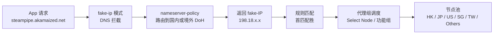

# Clash Rule Scripts

> Clash 配置预处理脚本 · 自动增强 DNS / 路由 / 代理组,让 fake-ip 模式也能稳跑 Steam 等下载。

[](https://github.com/mowangmowang/clash-rule-scripts/releases/tag/desktop-v1.4)
[](https://github.com/mowangmowang/clash-rule-scripts/releases/tag/mobile-v1.4)
[](LICENSE)
[](.)

[🇨🇳 **中文**](README.md) · [🇬🇧 English](README_EN.md)

[✨ 亮点](#亮点) · [🚀 使用方法](#使用方法) · [📦 文件一览](#文件一览) · [📊 代理组结构](#代理组结构) · [⚙️ 可定制点](#可定制点) · [🔍 FAQ](#faq) · [📜 CHANGELOG](CHANGELOG.md)

---

## ✨ 亮点

- **Steam 下载直连** — fake-ip 模式下也满速,不受代理隧道 UDP 损耗影响
- **一站式规则增强** — 注入 DNS、广告拦截、CN/境外分流、微软/苹果/谷歌等服务路由
- **自适应地区分组** — 自动识别节点地区(HK/JP/US/SG/TW),非主流节点归属 Others 组统一调度
- **OpenCode 专用组** — 为 opencode AI 编程代理的 Zen 网关流量提供独立策略控制
- **Telegram / Instagram / UHD 专用分流** — Telegram、Instagram 从社交媒体拆出独立组,uhdnow.com 超高清流媒体独立调度
- **Bettbox 可视化开关** — 适配 Bettbox(FlClash core),面板勾选分组即可开关;关闭的组不生成,指向它的规则沿回退链自动回退
- **桌面 + 移动同步维护** — 四套脚本各司其职,修改一只手同步

## 🚀 使用方法

> [!IMPORTANT]
> ⚠️ 本脚本仅用于**覆写机场提供的订阅配置**,不建议覆写自行编写的配置。脚本在订阅加载后执行 `main(config)`,就地增强 DNS / 路由 / 代理组;订阅更新时自定义规则不会丢失(由脚本运行时注入,不写进订阅 YAML)。

### 1. 选择脚本

| 脚本 | 适用客户端 | 注释 |
|------|-----------|------|
| `Clash_script_v1.js` | Clash Verge Rev(Windows / macOS / Linux) | 中文 |
| `Clash_script_v1_en.js` | Clash Verge Rev(Windows / macOS / Linux) | English |
| `Clash_script_mobile.js` | Clash Meta for Android / Stash(iOS) | 中文 |
| `ClashScript_ForBettbox.js` | Bettbox(FlClash core)/ Clash Meta / Stash | English,带可视化分组开关 |

桌面中英两版功能完全一致,任选其一;Bettbox 版额外提供面板分组开关与回退链,详见[代理组结构](#代理组结构)。

### 2. 复制链接(或下载文件)

**jsDelivr CDN(推荐,国内可访问,跟随最新版):**

```txt
https://fastly.jsdelivr.net/gh/mowangmowang/clash-rule-scripts@main/Clash_script_v1.js
https://fastly.jsdelivr.net/gh/mowangmowang/clash-rule-scripts@main/Clash_script_v1_en.js
https://fastly.jsdelivr.net/gh/mowangmowang/clash-rule-scripts@main/Clash_script_mobile.js
https://fastly.jsdelivr.net/gh/mowangmowang/clash-rule-scripts@main/ClashScript_ForBettbox.js
```

**锁定版本(把 `@main` 换成 tag,如 `@desktop-v1.4`,避免自动更新):**

```txt
https://fastly.jsdelivr.net/gh/mowangmowang/clash-rule-scripts@desktop-v1.4/Clash_script_v1.js
```

**GitHub 原始链接(CDN 不可用时备用):**

```txt
https://raw.githubusercontent.com/mowangmowang/clash-rule-scripts/main/Clash_script_v1.js
```

> 也可以直接在[发布页](https://github.com/mowangmowang/clash-rule-scripts/releases)下载对应 `.js` 文件,使用本地路径导入。

### 3. 导入客户端

**Clash Verge Rev(桌面):**

1. Profiles(配置)→ 新建(New)→ 类型选 **Script**
2. 粘贴上面的脚本链接,或选择已下载的本地 `.js` 文件
3. 保存后让该脚本与你的订阅 profile 关联,重载配置

**Clash Meta for Android:**

1. 设置 → 覆写(Override)→ 启用 JavaScript 覆写
2. 新建覆写项,粘贴脚本链接或代码
3. 回到配置页重载

**Stash(iOS):**

1. 设置 → 覆写脚本(Override Script)
2. 粘贴脚本链接或代码
3. 重载配置

**Bettbox(FlClash core):**

1. 配置 → 覆写脚本,粘贴 `ClashScript_ForBettbox.js` 的链接
2. 重载配置后,在策略组面板勾选要启用的分组(`ruleOptionsEnable`)
3. 未勾选的组不生成,指向它的规则自动沿 `serviceConfigs` 回退链回退(例如关闭 Telegram → Social Media → Fallback;关闭 UHD → Foreign Media → Fallback)

## 📦 文件一览

| 文件 | 客户端 | 注释 | 桌面 | 移动 |
|------|--------|------|------|------|
| `Clash_script_v1.js` | Clash Verge Rev | 中文 | ✅ | — |
| `Clash_script_v1_en.js` | Clash Verge Rev | English | ✅ | — |
| `Clash_script_mobile.js` | Clash Meta for Android / Stash | 中文 | — | ✅ |
| `ClashScript_ForBettbox.js` | Bettbox(FlClash core)/Clash Meta/Stash | English | — | ✅(可视化开关) |

桌面中英两版**功能完全一致**,修改必须同步。`ClashScript_ForBettbox.js` 在移动版基础上增加分组开关与回退链。文件名 `_v1` / `_mobile` 是系列代号,不随小版本变化;版本号靠 [CHANGELOG.md](CHANGELOG.md) + git tag。桌面与移动是独立发布线。

## 📊 代理组结构

面板按「常用 / 不常用」两区显示,`Fallback` 是分界线。仅视觉聚合,引用关系不受影响。
常用区顺序:`Select Node` → HK/JP/US → Google Services → Foreign Media → UHD → Social Media → Telegram → Instagram → AI Overseas → OpenCode → Microsoft/Apple/Steam(仅桌面) → Fallback。
Bettbox 版可在面板勾选开关关闭任意分组,该组不生成,指向它的规则沿 `serviceConfigs` 定义的回退链自动回退。

### 常用区(`Select Node` → `Fallback`)

| 分组 | 类型 | 说明 |
|------|------|------|
| `Select Node` | select | 顶层手动入口,含自动化组 + 全部节点(`include-all`) |
| `HK - 香港` / `JP - 日本` / `US - 美国` | select | 主流地区,正则自动识别节点名生成 |
| `Google Services` / `Foreign Media` | select | 功能组,上游为 `standardProxies` |
| `UHD` | select | uhdnow.com 超高清流媒体专用,上游为 `standardProxies`(Bettbox 关闭回退 Foreign Media) |
| `Social Media` / `Telegram` / `Instagram` | select | 社交媒体及拆分出的 TG/IG 专用组,上游为 `standardProxies`(Bettbox 关闭 TG/IG 回退 Social Media) |
| `AI Overseas` | select | ChatGPT / Gemini 等,健康检查 `chatgpt.com` |
| `OpenCode` | select | opencode 命令行代理自有流量(见下) |
| `Microsoft Services` / `Apple Services` / `Steam` | select | 平台服务,默认直连/代理因服务而异 |
| `Fallback` | select | 兜底组,未被规则命中的流量最终落点 |

### 不常用区(`Fallback` 之后)

| 分组 | 类型 | 说明 |
|------|------|------|
| `Others` | select | 聚合**所有节点**(`include-all`),覆盖非主流地区(KR/DE/UK 等) |
| `SG - 新加坡` / `TW - 台湾` | select | 非主流地区组,正则自动识别 |
| `Latency Test` | url-test | 自动选延迟最低节点 |
| `Failover` | fallback | 主节点失效自动切换 |
| `Load Balance (Hash)` / `Load Balance (Round Robin)` | load-balance | 一致性哈希 / 轮询(均 `hidden`) |
| `Ad Block` / `Global Block` | select | 拦截组,默认 `REJECT` |

### 地区组识别机制

`regions` 数组定义地区名 + 正则,**逐地区**从 `allProxies` 过滤节点名:
- 有匹配 → 生成 `select` 组;无匹配 → 跳过
- CJK 关键词无 `\b`(JS `\b` 对中文无效),英文/数字保留 `\b` 防子串误匹配
- `regionalGroupNames` 含所有地区组名(含 SG/TW/Others),合入 `standardProxies` 作为功能组可选上游

### OpenCode 组

路由 `opencode.ai`(Zen API 网关 / OAuth 登录 / 会话分享 / 文档站)+ `anoma.ly`(母公司域,账单/帮助站)。
健康检查用 `https://opencode.ai`。
**注意**:用户 BYOK 直连第三方 LLM(`api.openai.com` 等)的流量**不走此组**,仍由 `openai` 规则集 / `proxy` 列表 / `Fallback` 调度。

## ⚙️ 可定制点

打开任一 JS 文件,顶部一节是「常量定义」,改完保存即可生效:

| 变量 | 控制什么 | 常见改动 |
|------|---------|---------|
| `domesticNameservers` | 国内 DNS(解析 CN 域名) | 换更快的 DoH,如 `https://1.12.12.12/dns-query` |
| `foreignNameservers` | 境外 DNS | 换 Cloudflare / Google |
| `steamCDN` 列表 | Steam CDN 域名(直连解析) | 加新发现的 CDN |
| `proxyGroups` | 代理组定义 | 改名 / 改选择策略 |
| `healthCheck.interval` | 节点健康检查间隔 | 移动端调长省电 |
| `healthCheck.tolerance` | 延迟容忍 | 蜂窝网络调到 50 ms |
| `ruleOptionsEnable`(Bettbox) | 各分组是否在面板启用 | 设 `false` 关闭某组,规则自动回退 |
| `serviceConfigs`(Bettbox) | 关闭分组后的回退目标 | 修改 `fallback` 字段调整回退链 |

> 改完别忘了:四套脚本同步改(功能变更)+ 改 CHANGELOG + commit + 视情况打 tag。

## 🔍 FAQ

<details>
<summary>常见问题与故障排查</summary>

| 症状 | 原因 | 排查 |
|------|------|------|
| Steam 下载 0 bps | nameserver-policy 顺序错 | 确认 `steamCDN` 在 `geosite:geolocation-!cn` 之前 |
| Steam 下载走代理 | Steam CDN 进了 fake-ip-filter | 检查 `fake-ip-filter` 列表 |
| 国内网站解析到境外 IP | 国内 DNS 不通 | 测试 `domesticNameservers` 里的 DoH |
| 移动端节点延迟狂跳 | 容忍阈值太严 | 调 `healthCheck.tolerance` 到 50+ ms |
| 日志报 `main is not defined` | 客户端没启用 JS 预处理 | Profile 设置里勾上 Script |
| Clash Verge 加载报语法错 | 文件被存为 CRLF | 仓库已强制 LF,确认编辑器存为 LF |
| Bettbox 面板看不到某分组 | 该分组开关未勾选 | 检查脚本中 `ruleOptionsEnable`,确认对应项为 `true` |
| 关闭某组后规则报错/悬空 | 回退链未配置 | 确认 `serviceConfigs` 中该组的 `fallback` 指向一个始终启用的组 |

</details>

## 🔄 流量处理流程

<details>
<summary>点击展开 — 从 DNS 到代理的完整链路</summary>

下面以一个真实请求(应用要下载 Steam 内容 `steampipe.akamaized.net`)为线索,展示从 DNS 查询到上游代理的完整链路。

<div style="background-color: #ffffff; padding: 14px; border-radius: 6px;">



</div>

**关键节点说明:**

| 阶段 | 要点 |
|------|------|
| ① DNS | `fake-ip-filter` 命中 → 走真实 IP(局域网 / QQ 微信 / Windows Captive) |
| ① DNS | `nameserver-policy` 匹配 Steam CDN → 国内 DoH → 国内 CDN IP |
| ① DNS | 其他域名 → 境外 DoH(Cloudflare / OpenDNS / Mullvad)或 fallback 二次验证 |
| ② 规则 | 规则链首条命中即终止:Steam CDN → DIRECT / QUIC 阻断 → REJECT / … |
| ② 规则 | 功能组精确命中 → Apple / Google / AI / OpenCode / Steam |
| ② 规则 | `RULE-SET,proxy` + `MATCH` 兜底 → `Select Node` |
| ③ 调度 | 代理组最终汇聚到节点池,按 url-test / fallback / load-balance 选出节点 |

</details>

## 提交规范

| 前缀 | 用途 |
|------|------|
| `feat:` | 新规则、新功能 |
| `fix:` | 修复问题 |
| `refactor:` | 重构(不改变行为) |
| `perf:` | 性能优化 |
| `docs:` | 仅文档 |
| `chore:` | 杂项(初始化、配置) |

## 致谢

脚本引用以下第三方开源资源:

- **规则集**: [blackmatrix7/ios_rule_script](https://github.com/blackmatrix7/ios_rule_script) · [Loyalsoldier/clash-rules](https://github.com/Loyalsoldier/clash-rules)
- **DNS**: [阿里云 DNS](https://www.alidns.com/) · [腾讯 DNSPod](https://www.dnspod.cn/) · [Cloudflare](https://developers.cloudflare.com/1.1.1.1/) · [OpenDNS](https://www.opendns.com/) · [Mullvad DNS](https://mullvad.net/en/help/dns-over-https-and-dns-over-tls)
- **图标**: [clash-verge-rev/clash-verge-rev.github.io](https://github.com/clash-verge-rev/clash-verge-rev.github.io) · [Koolson/Qure](https://github.com/Koolson/Qure)

---

## 协议

[MIT](./LICENSE)
