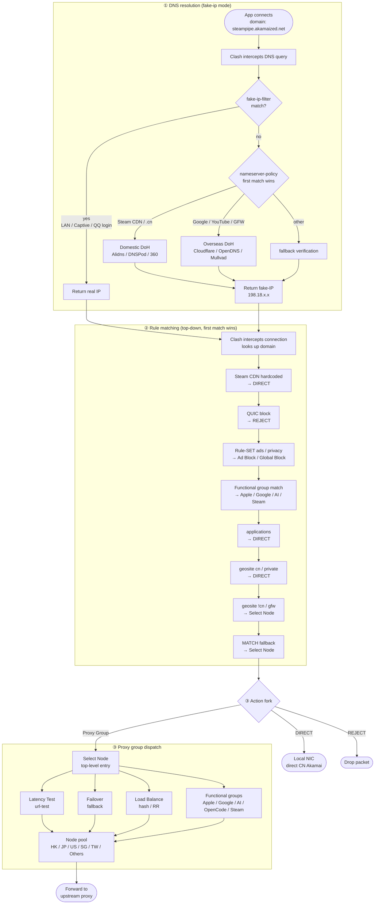

# Clash Rule Scripts

> Clash config preprocessing scripts — inject DNS, routing rules and proxy groups so fake-ip mode works flawlessly with Steam downloads and more.

[🇨🇳 中文](README.md) · [🇬🇧 English](README_EN.md)

---

## ✨ Highlights

- **Steam download direct-connect** — full speed even under fake-ip, unaffected by proxy tunnel UDP loss
- **All-in-one rule enhancement** — DNS injection, ad blocking, CN/overseas traffic split, Microsoft/Apple/Google routing
- **Adaptive regional grouping** — automatically detects proxy regions (HK/JP/US/SG/TW), non-mainstream nodes fall under `Others` for unified scheduling
- **OpenCode dedicated group** — independent policy control for the opencode AI coding agent's Zen gateway traffic
- **Desktop + mobile synced maintenance** — three scripts, one change set

## 🚀 Quick Start

**Desktop (Clash Verge Rev):**

1. Profiles → select a profile → Processing → Script
2. `Clash_script_v1.js` (Chinese comments) or `Clash_script_v1_en.js` (English comments)
3. Fill in the absolute script path, reload the profile

**Mobile (Clash Meta for Android / Stash):**

1. Settings → Script → enable JS preprocessing
2. Path: `Clash_script_mobile.js`
3. Reload config

The script runs `main(config)` automatically after the subscription is loaded, enhancing the config in place. Custom rules **survive subscription updates** — they are injected by the script, not written into YAML.

## 📦 File Overview

| File | Client | Comments | Desktop | Mobile |
|------|--------|----------|---------|--------|
| `Clash_script_v1.js` | Clash Verge Rev | Chinese | ✅ | — |
| `Clash_script_v1_en.js` | Clash Verge Rev | English | ✅ | — |
| `Clash_script_mobile.js` | Clash Meta for Android / Stash | Chinese | — | ✅ |

Desktop CN and EN versions are **functionally identical**; any modification must be synced across both. File names `_v1` / `_mobile` are series code names and do not change with minor versions — versioning is tracked via [CHANGELOG.md](CHANGELOG.md) + git tags. Desktop and mobile are independent release lines.

## 📊 Proxy Group Structure

The panel displays groups in two sections — **Common** and **Uncommon** — separated by `Fallback`. This is visual clustering only; reference relationships are unchanged.

### Common section (`Select Node` → `Fallback`)

| Group | Type | Description |
|-------|------|-------------|
| `Select Node` | select | Top-level manual entry, includes automation groups + all proxies (`include-all`) |
| `HK - 香港` / `JP - 日本` / `US - 美国` | select | Mainstream regions, auto-detected from proxy names via regex |
| `Google Services` / `Foreign Media` / `Social Media` | select | Functional groups, upstream via `standardProxies` |
| `AI Overseas` | select | ChatGPT / Gemini etc., health-check `chatgpt.com` |
| `OpenCode` | select | opencode CLI's own traffic (see below) |
| `Microsoft Services` / `Apple Services` / `Steam` | select | Platform services, default DIRECT or proxy per service |
| `Fallback` | select | Catch-all group for unmatched traffic |

### Uncommon section (after `Fallback`)

| Group | Type | Description |
|-------|------|-------------|
| `Others` | select | Aggregates **all proxies** (`include-all`), covering non-mainstream regions (KR/DE/UK etc.) |
| `SG - 新加坡` / `TW - 台湾` | select | Non-mainstream regions, auto-detected via regex |
| `Latency Test` | url-test | Auto-selects the lowest-latency node |
| `Failover` | fallback | Automatically falls through on primary failure |
| `Load Balance (Hash)` / `Load Balance (Round Robin)` | load-balance | Consistent hashing / round-robin (both `hidden`) |
| `Ad Block` / `Global Block` | select | Block groups, default `REJECT` |

### Regional detection mechanism

The `regions` array defines region names and regex patterns, filtering `allProxies` **per region**:
- Match found → generates a `select` group; no match → skipped
- CJK keywords are matched without `\b` (JS `\b` does not fire on CJK); English/numeric alternatives keep `\b` to avoid substring false positives
- `regionalGroupNames` includes all region names (including SG/TW/Others), merged into `standardProxies` as optional upstreams for functional groups

### OpenCode group

Routes `opencode.ai` (Zen API gateway / OAuth login / session sharing / documentation site) and `anoma.ly` (parent-company domain, billing / help site).
Health-check target: `https://opencode.ai`.
**NOTE**: BYOK traffic going directly to third-party LLMs (`api.openai.com`, etc.) does **NOT** traverse this group; it remains governed by the existing `openai` rule-set, `proxy` list and `Fallback` group.

## ⚙️ Customisation

Open any JS file — the top section contains "constants". Edit and save to apply:

| Variable | What it controls | Common tweaks |
|----------|-----------------|---------------|
| `domesticNameservers` | Domestic DNS (CN domains) | Faster DoH, e.g. `https://1.12.12.12/dns-query` |
| `foreignNameservers` | Overseas DNS | Cloudflare / Google |
| `steamCDN` list | Steam CDN domains (direct-connect) | Add newly discovered CDNs |
| `proxyGroups` | Proxy group definitions | Rename / change selection strategy |
| `healthCheck.interval` | Node health-check interval | Increase on mobile for battery |
| `healthCheck.tolerance` | Latency tolerance | 50 ms for cellular networks |

> After editing: sync CN + EN versions + update CHANGELOG + commit + tag when appropriate.

## 🔍 FAQ

Common issues and troubleshooting

| Symptom | Cause | Check |
|---------|-------|-------|
| Steam download 0 bps | Incorrect nameserver-policy order | Ensure `steamCDN` entries precede `geosite:geolocation-!cn` |
| Steam download goes through proxy | Steam CDN in fake-ip-filter | Review the `fake-ip-filter` list |
| Domestic sites resolve to foreign IPs | Domestic DNS unreachable | Test `domesticNameservers` DoH endpoints |
| Mobile node latency spikes | Tolerance too tight | Set `healthCheck.tolerance` to 50+ ms |
| Log error `main is not defined` | JS preprocessing not enabled | Enable Script in profile settings |
| Clash Verge syntax error | File saved with CRLF | Repo enforces LF; configure your editor to save as LF |

## 🔄 Traffic Flow

Click to expand — full path from DNS to upstream proxy

The following walkthrough traces a real request (the app downloading Steam content from `steampipe.akamaized.net`) from DNS resolution to upstream proxy selection.

**Key points:**

| Stage | Detail |
|-------|--------|
| ① DNS | `fake-ip-filter` hit → real IP (LAN / QQ WeChat / Windows Captive) |
| ① DNS | `nameserver-policy` matches Steam CDN → domestic DoH → domestic CDN IP |
| ② Rules | First 3 rules are `DIRECT` (Steam CDN / QUIC / applications) |
| ② Rules | Last 2 rules point to `Select Node` (geosite !cn + MATCH fallback) |
| ③ Dispatch | All groups converge on the node pool, selected via url-test / fallback / load-balance |

## Commit Convention

| Prefix | Purpose |
|--------|---------|
| `feat:` | New rule or feature |
| `fix:` | Bug fix |
| `refactor:` | Refactoring (behaviour unchanged) |
| `perf:` | Performance improvement |
| `docs:` | Documentation only |
| `chore:` | Misc (init, config) |

## Credits

This project references the following third-party open-source resources:

- **Rule sets**: [blackmatrix7/ios_rule_script](https://github.com/blackmatrix7/ios_rule_script) · [Loyalsoldier/clash-rules](https://github.com/Loyalsoldier/clash-rules)
- **DNS**: [Alibaba DNS](https://www.alidns.com/) · [DNSPod (Tencent)](https://www.dnspod.cn/) · [Cloudflare](https://developers.cloudflare.com/1.1.1.1/) · [OpenDNS](https://www.opendns.com/) · [Mullvad DNS](https://mullvad.net/en/help/dns-over-https-and-dns-over-tls)
- **Icons**: [clash-verge-rev/clash-verge-rev.github.io](https://github.com/clash-verge-rev/clash-verge-rev.github.io)

---

## License

[MIT](./LICENSE)
