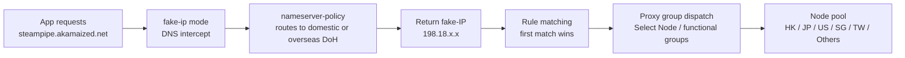

# Clash Rule Scripts

> Clash config preprocessing scripts — inject DNS, routing rules and proxy groups so fake-ip mode works flawlessly with Steam downloads and more.

[](https://github.com/mowangmowang/clash-rule-scripts/releases/tag/desktop-v1.5)
[](https://github.com/mowangmowang/clash-rule-scripts/releases/tag/mobile-v1.5)
[](LICENSE)
[](.)

[🇨🇳 中文](README.md) · [🇬🇧 English](README_EN.md)

---

## ✨ Highlights

- **Steam download direct-connect** — full speed even under fake-ip, unaffected by proxy tunnel UDP loss
- **All-in-one rule enhancement** — DNS injection, ad blocking, CN/overseas traffic split, Microsoft/Apple/Google routing
- **Bing follows Microsoft group** — bing.com / bing.net / bingusercontent.com search and content domains follow the `Microsoft Services` group, switchable as a whole between DIRECT and proxy
- **Adaptive regional grouping** — automatically detects proxy regions (HK/JP/US/SG/TW), non-mainstream nodes fall under `Others` for unified scheduling
- **OpenCode dedicated group** — independent policy control for the opencode AI coding agent's Zen gateway traffic
- **GitHub dedicated routing** — GitHub ecosystem (github.com / ghcr.io / npm / Copilot, etc.) gets its own group, upstream via `standardProxies`
- **Dedicated Telegram / Instagram / UHD / VK groups** — Telegram and Instagram split out from Social Media; uhdnow.com UHD streaming gets its own group; all VK ecosystem domains (social / video / VK Play) get dedicated routing
- **Bettbox visual toggles** — Bettbox (FlClash core) build with per-group switches; disabled groups are not generated and rules targeting them fall back along a chain
- **Desktop + mobile synced maintenance** — four scripts, one change set

## 🚀 Usage

> [!IMPORTANT]
> ⚠️ This script is intended to **override an airport-provided subscription config**; it is not recommended for overriding a hand-written config. The script runs `main(config)` after the subscription loads, enhancing DNS / routing / proxy groups in place. Custom rules survive subscription updates because they are injected at runtime, not written into the subscription YAML.

### 1. Pick a script

| Script | Client | Comments |
|--------|--------|----------|
| `Clash_script_v1.js` | Clash Verge Rev (Windows / macOS / Linux) | Chinese |
| `Clash_script_v1_en.js` | Clash Verge Rev (Windows / macOS / Linux) | English |
| `Clash_script_mobile.js` | Clash Meta for Android / Stash (iOS) | Chinese |
| `ClashScript_ForBettbox.js` | Bettbox (FlClash core) / Clash Meta / Stash | English, with visual group toggles |

The desktop CN and EN builds are functionally identical — pick either. The Bettbox build additionally adds per-group panel toggles and a fallback chain; see [Proxy Group Structure](#proxy-group-structure).

### 2. Copy a link (or download the file)

**jsDelivr CDN (recommended, follows latest):**

```txt
https://fastly.jsdelivr.net/gh/mowangmowang/clash-rule-scripts@main/Clash_script_v1.js
https://fastly.jsdelivr.net/gh/mowangmowang/clash-rule-scripts@main/Clash_script_v1_en.js
https://fastly.jsdelivr.net/gh/mowangmowang/clash-rule-scripts@main/Clash_script_mobile.js
https://fastly.jsdelivr.net/gh/mowangmowang/clash-rule-scripts@main/ClashScript_ForBettbox.js
```

**Pin a version (replace `@main` with a tag such as `@desktop-v1.5` to opt out of auto-updates):**

```txt
https://fastly.jsdelivr.net/gh/mowangmowang/clash-rule-scripts@desktop-v1.5/Clash_script_v1.js
```

**GitHub raw link (fallback if the CDN is unavailable):**

```txt
https://raw.githubusercontent.com/mowangmowang/clash-rule-scripts/main/Clash_script_v1.js
```

> You can also download the `.js` file directly from the [releases page](https://github.com/mowangmowang/clash-rule-scripts/releases) and import it by local path.

### 3. Import into your client

**Clash Verge Rev (desktop):**

1. Profiles → New → type **Script**
2. Paste the script link above, or select a downloaded local `.js` file
3. Save, associate the script with your subscription profile, and reload

**Clash Meta for Android:**

1. Settings → Override → enable JavaScript override
2. Create a new override and paste the script link or code
3. Reload your config

**Stash (iOS):**

1. Settings → Override Script
2. Paste the script link or code
3. Reload your config

**Bettbox (FlClash core):**

1. Config → Override Script, paste the `ClashScript_ForBettbox.js` link
2. After reload, enable groups via the `ruleOptionsEnable` toggles in the group panel
3. A disabled group is not generated; rules targeting it automatically fall back through the `serviceConfigs` chain (e.g. Telegram off -> Social Media -> Fallback; UHD off -> Foreign Media -> Fallback)

## 📦 File Overview

| File | Client | Comments | Desktop | Mobile |
|------|--------|----------|---------|--------|
| `Clash_script_v1.js` | Clash Verge Rev | Chinese | ✅ | — |
| `Clash_script_v1_en.js` | Clash Verge Rev | English | ✅ | — |
| `Clash_script_mobile.js` | Clash Meta for Android / Stash | Chinese | — | ✅ |
| `ClashScript_ForBettbox.js` | Bettbox (FlClash core) / Clash Meta / Stash | English | — | ✅ (visual toggles) |

Desktop CN and EN versions are **functionally identical**; any modification must be synced across both. `ClashScript_ForBettbox.js` extends the mobile build with per-group toggles and a fallback chain. File names `_v1` / `_mobile` are series code names and do not change with minor versions — versioning is tracked via [CHANGELOG.md](CHANGELOG.md) + git tags. Desktop and mobile are independent release lines.

## 📊 Proxy Group Structure

The panel displays groups in two sections — **Common** and **Uncommon** — separated by `Fallback`. This is visual clustering only; reference relationships are unchanged.
Common order: `Select Node` -> HK/JP/US -> Google Services -> GitHub -> Foreign Media -> UHD -> Social Media -> Telegram -> Instagram -> VK -> AI Overseas -> OpenCode -> Microsoft/Apple/Steam (desktop only) -> Fallback.
In the Bettbox build any group can be toggled off; the group is omitted and rules targeting it fall back through the chain defined in `serviceConfigs`.

### Common section (`Select Node` → `Fallback`)

| Group | Type | Description |
|-------|------|-------------|
| `Select Node` | select | Top-level manual entry, includes automation groups + all proxies (`include-all`) |
| `HK - 香港` / `JP - 日本` / `US - 美国` | select | Mainstream regions, auto-detected from proxy names via regex |
| `Google Services` | select | Google services, upstream via `standardProxies` |
| `GitHub` | select | GitHub services (github.com / ghcr.io / npm / Copilot), upstream via `standardProxies` (Bettbox: falls back to Fallback) |
| `Foreign Media` | select | Overseas streaming (YouTube / Netflix etc.), upstream via `standardProxies` |
| `UHD` | select | uhdnow.com UHD streaming, upstream via `standardProxies` (Bettbox: falls back to Foreign Media) |
| `Social Media` / `Telegram` / `Instagram` / `VK` | select | Social media plus split-out TG/IG/VK groups, upstream via `standardProxies`; VK group health-check vk.com (Bettbox: TG/IG/VK fall back to Social Media) |
| `AI Overseas` | select | ChatGPT / Gemini etc., health-check `chatgpt.com` |
| `OpenCode` | select | opencode CLI's own traffic (see below) |
| `Microsoft Services` / `Apple Services` / `Steam` | select | Platform services, default DIRECT or proxy per service; Bing domains follow the Microsoft group |
| `Fallback` | select | Catch-all group for unmatched traffic |

### Uncommon section (after `Fallback`)

| Group | Type | Description |
|-------|------|-------------|
| `Others` | select | Aggregates **all proxies** (`include-all`), covering non-mainstream regions (KR/DE/UK etc.) |
| `SG - 新加坡` / `TW - 台湾` | select | Non-mainstream regions, auto-detected via regex |
| `Latency Test` | url-test | Auto-selects the lowest-latency node |
| `Failover` | fallback | Automatically falls through on primary failure |
| `Load Balance (Hash)` / `Load Balance (Round Robin)` | load-balance | Consistent hashing / round-robin (both `hidden`) |
| `Ad Block` / `Global Block` | select | Block groups, default `REJECT` |

### Regional detection mechanism

The `regions` array defines region names and regex patterns, filtering `allProxies` **per region**:
- Match found → generates a `select` group; no match → skipped
- CJK keywords are matched without `\b` (JS `\b` does not fire on CJK); English/numeric alternatives keep `\b` to avoid substring false positives
- `regionalGroupNames` includes all region names (including SG/TW/Others), merged into `standardProxies` as optional upstreams for functional groups

### OpenCode group

Routes `opencode.ai` (Zen API gateway / OAuth login / session sharing / documentation site) and `anoma.ly` (parent-company domain, billing / help site).
Health-check target: `https://opencode.ai`.
**NOTE**: BYOK traffic going directly to third-party LLMs (`api.openai.com`, etc.) does **NOT** traverse this group; it remains governed by the existing `openai` rule-set, `proxy` list and `Fallback` group.

## ⚙️ Customisation

Open any JS file — the top section contains "constants". Edit and save to apply:

| Variable | What it controls | Common tweaks |
|----------|-----------------|---------------|
| `domesticNameservers` | Domestic DNS (CN domains) | Faster DoH, e.g. `https://1.12.12.12/dns-query` |
| `foreignNameservers` | Overseas DNS | Cloudflare / Google |
| `steamCDN` list | Steam CDN domains (direct-connect) | Add newly discovered CDNs |
| `proxyGroups` | Proxy group definitions | Rename / change selection strategy |
| `healthCheck.interval` | Node health-check interval | Increase on mobile for battery |
| `healthCheck.tolerance` | Latency tolerance | 50 ms for cellular networks |
| `ruleOptionsEnable` (Bettbox) | Whether each group is enabled in the panel | Set `false` to disable; rules auto-fallback |
| `serviceConfigs` (Bettbox) | Fallback target when a group is disabled | Edit the `fallback` field to rewire the chain |

> After editing: sync all four scripts for functional changes + update CHANGELOG + commit + tag when appropriate.

## 🔍 FAQ

<details>
<summary>Common issues and troubleshooting</summary>

| Symptom | Cause | Check |
|---------|-------|-------|
| Steam download 0 bps | Incorrect nameserver-policy order | Ensure `steamCDN` entries precede `geosite:geolocation-!cn` |
| Steam download goes through proxy | Steam CDN in fake-ip-filter | Review the `fake-ip-filter` list |
| Domestic sites resolve to foreign IPs | Domestic DNS unreachable | Test `domesticNameservers` DoH endpoints |
| Mobile node latency spikes | Tolerance too tight | Set `healthCheck.tolerance` to 50+ ms |
| Log error `main is not defined` | JS preprocessing not enabled | Enable Script in profile settings |
| Clash Verge syntax error | File saved with CRLF | Repo enforces LF; configure your editor to save as LF |
| A group is missing from the Bettbox panel | Its toggle is off | Check `ruleOptionsEnable` and ensure the entry is `true` |
| Rules error / dangling after disabling a group | Fallback chain unset | Ensure `serviceConfigs` has a `fallback` pointing to an always-enabled group |

</details>

## 🔄 Traffic Flow

<details>
<summary>Click to expand — full path from DNS to upstream proxy</summary>

The following walkthrough traces a real request (the app downloading Steam content from `steampipe.akamaized.net`) from DNS resolution to upstream proxy selection.

<div style="background-color: #ffffff; padding: 14px; border-radius: 6px;">



</div>

**Key points:**

| Stage | Detail |
|-------|--------|
| ① DNS | `fake-ip-filter` hit → real IP (LAN / QQ WeChat / Windows Captive) |
| ① DNS | `nameserver-policy` matches Steam CDN → domestic DoH → domestic CDN IP |
| ① DNS | Other domains → overseas DoH (Cloudflare / OpenDNS / Mullvad) or fallback verification |
| ② Rules | First match wins: Steam CDN → DIRECT / QUIC block → REJECT / … |
| ② Rules | Functional group exact match → Apple / Google / AI / OpenCode / Steam |
| ② Rules | `RULE-SET,proxy` + `MATCH` fallback → `Select Node` |
| ③ Dispatch | All groups converge on the node pool, selected via url-test / fallback / load-balance |

</details>

## Commit Convention

| Prefix | Purpose |
|--------|---------|
| `feat:` | New rule or feature |
| `fix:` | Bug fix |
| `refactor:` | Refactoring (behaviour unchanged) |
| `perf:` | Performance improvement |
| `docs:` | Documentation only |
| `chore:` | Misc (init, config) |

## Credits

This project references the following third-party open-source resources:

- **Rule sets**: [blackmatrix7/ios_rule_script](https://github.com/blackmatrix7/ios_rule_script) · [Loyalsoldier/clash-rules](https://github.com/Loyalsoldier/clash-rules)
- **DNS**: [Alibaba DNS](https://www.alidns.com/) · [DNSPod (Tencent)](https://www.dnspod.cn/) · [Cloudflare](https://developers.cloudflare.com/1.1.1.1/) · [OpenDNS](https://www.opendns.com/) · [Mullvad DNS](https://mullvad.net/en/help/dns-over-https-and-dns-over-tls)
- **Icons**: [clash-verge-rev/clash-verge-rev.github.io](https://github.com/clash-verge-rev/clash-verge-rev.github.io) · [Koolson/Qure](https://github.com/Koolson/Qure)

---

## License

[MIT](./LICENSE)
